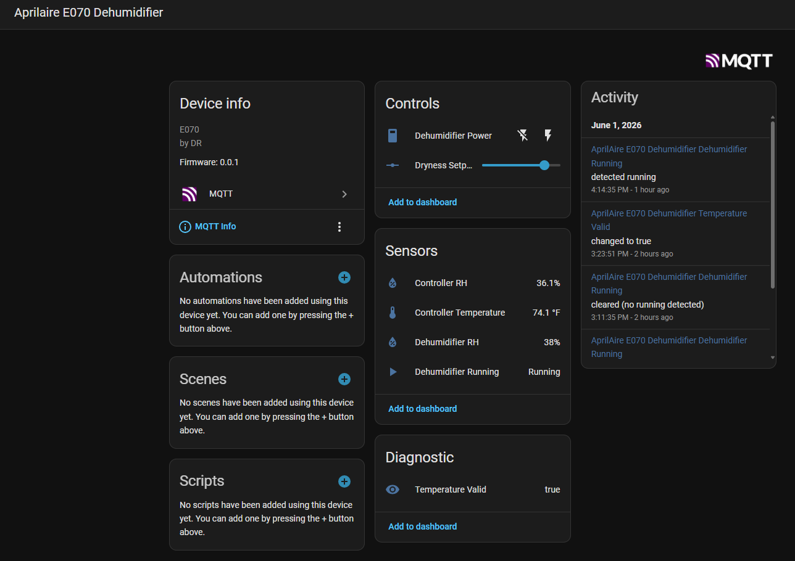

# AprilAire E070 Dehumidifier Controller

An ESP32-C6 based replacement for the AprilAire Model 76 remote control, integrating the E070 dehumidifier with Home Assistant via MQTT over Wi-Fi.



## Overview

The AprilAire E070 dehumidifier communicates with its Model 76 remote control over a proprietary RS-485 bus. This project reverse-engineers that protocol and replaces the Model 76 with an ESP32-C6 microcontroller, adding:

- Wi-Fi connectivity with a captive portal for easy setup
- MQTT integration with automatic Home Assistant device discovery
- Local temperature and humidity sensing via BME280
- Real-time control of power and dryness setpoint from Home Assistant
- Sensor calibration offsets for accurate readings

## Hardware

### Required

| Component | Notes |
|-----------|-------|
| Waveshare ESP32-C6-DEV-KIT-N8 | Main controller |
| MAX485 breakout module | RS-485 transceiver |
| Adafruit BME280 with StemmaQT | Temperature and humidity sensor |
| StemmaQT to DuPont cable | For BME280 connection |
| Momentary pushbutton | For Wi-Fi credential reset |

### Wiring

#### RS-485 (LP UART)

| ESP32-C6 | MAX485 Module |
|----------|---------------|
| GPIO4 (TX) | DI |
| GPIO5 (RX) | RO |
| 3.3V | VCC |
| GND | GND |

Connect the MAX485 A and B terminals to the AprilAire E070 RS-485 bus (the `+ -` terminals on the E070 terminal block, or the A and B wires from the Model 76 connector).

> **Note:** The MAX485 module must expose DE and RE pins for transmit/receive switching. Modules with DE/RE hardwired internally are not compatible.

#### BME280 (LP I2C via StemmaQT)

| StemmaQT Cable | ESP32-C6 |
|----------------|----------|
| Black (GND) | GND |
| Red (3.3V) | 3V3 |
| Blue (SDA) | GPIO6 |
| Yellow (SCL) | GPIO7 |

#### Reset Button

| Component | ESP32-C6 |
|-----------|----------|
| Button pin 1 | GPIO10 |
| Button pin 2 | GND |

The internal pullup is enabled in firmware — no external resistor needed.

## Protocol

The E070 communicates over RS-485 at 9600 baud, 8N1. All frame data is ASCII hex encoded between STX (0x02) and ETX (0x03) delimiters.

### M-Frame (E070 → Controller)

Broadcast by the E070 approximately every 1 second.

```
STX  'M'  cmd  rh[2]  '0''0'  cs[2]  ETX
```

| Field | Description |
|-------|-------------|
| cmd | `?` = idle, `!` = running |
| rh | RH% as 2 hex chars (e.g. `3A` = 58%) |
| cs | Checksum (sum of all bytes including STX, mod 256) |

### R-Frame (Controller → E070)

Sent by the controller in response to each M-frame within ~2ms.

```
STX  'R'  on[2]  dryness[2]  rh[4]  sep[2]  temp[2]  cs[2]  ETX
```

| Field | Description |
|-------|-------------|
| on | `01` = run enabled, `00` = off |
| dryness | Setpoint 1–6 as 2 hex chars |
| rh | Controller RH × 10 as 4 hex chars (e.g. `0226` = 55.0%) |
| sep | `00` = temperature valid, `01` = temperature not yet valid |
| temp | Controller temp × 10 as 2 hex chars (e.g. `D8` = 21.6°C) |
| cs | Checksum |

## Firmware

### Prerequisites

- [ESP-IDF v5.5](https://docs.espressif.com/projects/esp-idf/en/v5.5/esp32c6/get-started/index.html) or later
- Python 3.8+

### Dependencies

The following components are pulled in automatically via `idf_component_manager`:

```
idf.py add-dependency "espressif/bme280"
```

### Building

```bash
git clone https://github.com/dwrice0/aprilaire-e070-controller
cd aprilaire-e070-controller
idf.py set-target esp32c6
idf.py build
idf.py flash monitor
```

### First-Time Setup

1. Flash the firmware — on first boot with no saved credentials the ESP32 starts a Wi-Fi access point named **AprilAire-Setup**
2. Connect your phone or computer to **AprilAire-Setup**
3. A captive portal will open automatically — if it doesn't, navigate to `http://192.168.4.1`
4. Enter your Wi-Fi network name and password
5. Enter your MQTT broker address, port, and credentials
6. Click **Save & Connect** — the device restarts and connects to your network
7. In Home Assistant go to **Settings → Devices & Services → MQTT** — the **AprilAire E070 Dehumidifier** device will appear automatically

### Resetting Wi-Fi Credentials

Hold the reset button (GPIO10) while powering on:

1. The RGB LED flashes **yellow** while counting 3 seconds — keep holding
2. At 3 seconds the LED turns **solid green** — release the button
3. The LED flashes **green 3 times** to confirm
4. The device clears credentials and restarts into setup mode

Releasing the button before 3 seconds cancels the reset and boots normally.

## Home Assistant Integration

The firmware uses MQTT Discovery to automatically create a device in Home Assistant with the following entities:

| Entity | Type | Description |
|--------|------|-------------|
| Dehumidifier Power | Switch | Enable/disable the dehumidifier |
| Dryness Setpoint | Number (1–6) | Target dryness level |
| Dehumidifier RH | Sensor | RH% reported by the E070's internal sensor |
| Dehumidifier Running | Binary Sensor | Whether the E070 is actively running |
| Controller RH | Sensor | RH% from the BME280 (calibration-corrected) |
| Controller Temperature | Sensor | Temperature from the BME280 (calibration-corrected) |
| Temperature Valid | Sensor | Whether BME280 has a valid temperature reading |

No `configuration.yaml` changes are needed.

### MQTT Topics

| Topic | Direction | Description |
|-------|-----------|-------------|
| `aprilaire/status` | ESP32 → HA | JSON status payload, published on change |
| `aprilaire/set` | HA → ESP32 | JSON command payload |
| `aprilaire/raw` | ESP32 → HA | Raw RS-485 frame bytes for debugging |

#### Status payload example

```json
{
  "m_rh": 54,
  "m_running": true,
  "r_on": true,
  "r_dryness": 4,
  "r_rh": 57.1,
  "r_temp": 21.6,
  "r_temp_valid": true
}
```

#### Set payload examples

```json
{"on": true}
{"on": false}
{"dryness": 4}
{"on": true, "dryness": 3}
```

## Sensor Calibration

The BME280 may read slightly differently from the E070's internal sensor due to placement and self-heating. The firmware applies fixed calibration offsets before sending sensor values to the E070:

```c
#define RH_OFFSET    3.0f   /* % — add to BME280 reading */
#define TEMP_OFFSET  1.27f  /* °C — add to BME280 reading */
```

To determine offsets for your installation, run the device alongside the original Model 76 for 48–72 hours before disconnecting it, and compare the readings. See the [Calibration Guide](docs/calibration.md) for detailed instructions using Grafana and InfluxDB.

## Project Structure

```
aprilaire-e070-controller/
├── main/
│   ├── main.c              # Main application — RS-485, MQTT, BME280
│   ├── provisioning.c      # Captive portal Wi-Fi provisioning
│   ├── provisioning.h
│   └── CMakeLists.txt
├── managed_components/     # Auto-generated by idf_component_manager
├── CMakeLists.txt
├── sdkconfig.defaults
└── README.md
```

## Technical Notes

### LP UART FIFO Limitation

The ESP32-C6's LP UART has a 16-byte hardware FIFO. Since the R-frame is 17 bytes, incoming frames are split across two UART events. The firmware handles this transparently with a reassembly buffer that accumulates bytes until a complete STX…ETX frame is detected.

### Timing

The E070 expects an R-frame response within approximately 2ms of the M-frame ending. The firmware uses `vTaskDelay(pdMS_TO_TICKS(2))` before transmitting. If the E070 doesn't respond to commands, try reducing this value or replacing it with `esp_rom_delay_us(2000)` for a more precise delay.

### Half-Duplex Bus

The RS-485 bus is half-duplex. The MAX485 module must have DE and RE pins exposed and connected together to a GPIO for direction control. The current implementation toggles direction via GPIO before transmitting and returns to receive mode after the frame is sent.

## License

GPLv3 License — see [LICENSE](LICENSE) for details.

## Acknowledgements

Protocol reverse-engineered via logic analyzer captures of the AprilAire Model 76 remote control communicating with the E070 dehumidifier. This project is not affiliated with or endorsed by AprilAire.